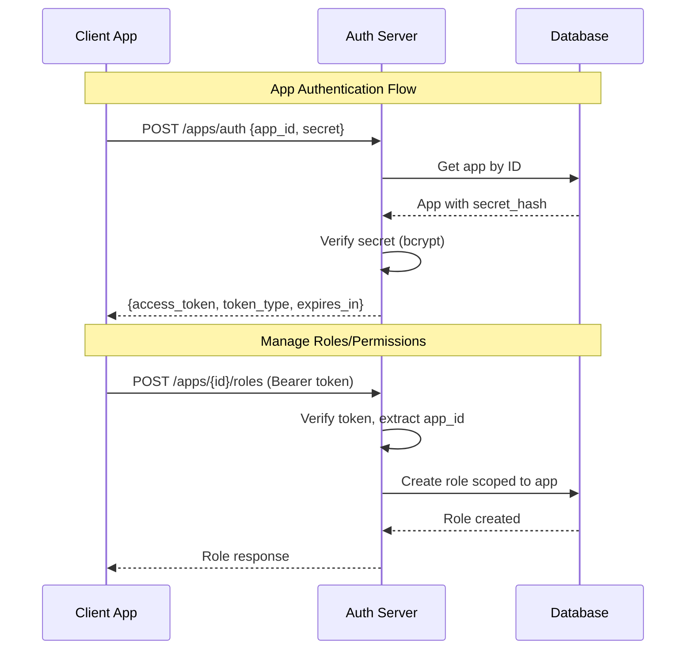

# Design Document: App Secret Authentication

## Overview

Tính năng này mở rộng hệ thống auth server để hỗ trợ xác thực machine-to-machine (M2M) thông qua App ID và Secret. Mỗi App sẽ có một secret key được sinh tự động khi tạo, cho phép các backend services xác thực và quản lý roles/permissions mà không cần user intervention.

Ngoài ra, tính năng cũng bao gồm endpoint GET /users/me để user có thể lấy thông tin profile từ access token.

## Architecture



## Components and Interfaces

### 1. Database Schema Changes

Thêm cột `secret_hash` vào bảng `apps`:

```sql
ALTER TABLE apps ADD COLUMN secret_hash VARCHAR(255);
```

### 2. App Model Update

```rust
pub struct App {
    pub id: Uuid,
    pub code: String,
    pub name: String,
    pub owner_id: Option<Uuid>,
    pub secret_hash: Option<String>,  // New field
}
```

### 3. DTOs

```rust
// Request để xác thực App
pub struct AppAuthRequest {
    pub app_id: Uuid,
    pub secret: String,
}

// Response khi xác thực App thành công
pub struct AppAuthResponse {
    pub access_token: String,
    pub token_type: String,  // "Bearer"
    pub expires_in: i64,
}

// Response khi tạo App (bao gồm secret)
pub struct CreateAppWithSecretResponse {
    pub id: Uuid,
    pub code: String,
    pub name: String,
    pub secret: String,  // Plain-text, chỉ trả về 1 lần
}

// Response khi regenerate secret
pub struct RegenerateSecretResponse {
    pub secret: String,  // Plain-text, chỉ trả về 1 lần
}

// Response cho GET /users/me
pub struct UserProfileResponse {
    pub id: Uuid,
    pub email: String,
    pub is_active: bool,
    pub email_verified: bool,
    pub created_at: DateTime<Utc>,
}
```

### 4. JWT Claims cho App Token

```rust
pub struct AppTokenClaims {
    pub sub: String,      // App ID
    pub app_id: Uuid,     // App ID (for clarity)
    pub token_type: String, // "app"
    pub exp: i64,
    pub iat: i64,
}
```

### 5. Service Layer

```rust
impl AppService {
    // Tạo app với secret
    pub async fn create_app_with_secret(&self, code: &str, name: &str, owner_id: Uuid) 
        -> Result<(App, String), AppError>;
    
    // Xác thực app bằng ID và secret
    pub async fn authenticate_app(&self, app_id: Uuid, secret: &str) 
        -> Result<String, AppError>;  // Returns access token
    
    // Regenerate secret (chỉ owner)
    pub async fn regenerate_secret(&self, app_id: Uuid, requester_id: Uuid) 
        -> Result<String, AppError>;  // Returns new secret
    
    // Verify app token và trả về app_id
    pub async fn verify_app_token(&self, token: &str) 
        -> Result<Uuid, AppError>;
}
```

### 6. API Endpoints

| Method | Endpoint | Auth | Description |
|--------|----------|------|-------------|
| POST | /apps | JWT (User) | Tạo app mới, trả về secret |
| POST | /apps/auth | None | Xác thực app bằng ID + Secret |
| POST | /apps/{id}/secret/regenerate | JWT (Owner) | Regenerate secret |
| GET | /users/me | JWT (User) | Lấy thông tin user hiện tại |
| POST | /apps/{id}/roles | JWT (App) | Tạo role trong app |
| GET | /apps/{id}/roles | JWT (App) | List roles trong app |
| POST | /apps/{id}/permissions | JWT (App) | Tạo permission trong app |
| GET | /apps/{id}/permissions | JWT (App) | List permissions trong app |

### 7. Middleware cho App Authentication

```rust
pub async fn app_auth_middleware(
    State(state): State<AppState>,
    mut request: Request<Body>,
    next: Next,
) -> Result<Response, AuthError> {
    // Extract token from Authorization header
    // Verify token type is "app"
    // Inject app_id into request extensions
}
```

## Data Models

### App Entity (Updated)

```rust
pub struct App {
    pub id: Uuid,
    pub code: String,
    pub name: String,
    pub owner_id: Option<Uuid>,
    pub secret_hash: Option<String>,
}
```

### App Token Claims

```rust
pub struct AppClaims {
    pub sub: String,        // App ID as string
    pub app_id: Uuid,       // App ID
    pub token_type: String, // "app" to distinguish from user tokens
    pub exp: i64,
    pub iat: i64,
}
```

## Correctness Properties

*A property is a characteristic or behavior that should hold true across all valid executions of a system-essentially, a formal statement about what the system should do. Properties serve as the bridge between human-readable specifications and machine-verifiable correctness guarantees.*

### Property 1: Secret Generation Quality
*For any* newly created App, the generated secret SHALL be at least 32 characters long and contain alphanumeric characters.
**Validates: Requirements 1.1, 1.4**

### Property 2: Secret Storage Security
*For any* App with a secret, the database SHALL store only a bcrypt hash (starting with $2b$) and never the plain-text secret.
**Validates: Requirements 1.3, 9.2**

### Property 3: Secret Regeneration Invalidates Previous
*For any* App, after regenerating the secret, authentication with the old secret SHALL fail and authentication with the new secret SHALL succeed.
**Validates: Requirements 2.1, 2.2**

### Property 4: Owner-Only Secret Regeneration
*For any* user who is not the App owner, attempting to regenerate the App's secret SHALL be rejected with 403 Forbidden.
**Validates: Requirements 2.4**

### Property 5: App Authentication Round-Trip
*For any* App with valid credentials (app_id, secret), calling POST /apps/auth SHALL return a valid access token that can be used for subsequent authenticated requests.
**Validates: Requirements 3.1, 3.2**

### Property 6: Invalid Credentials Rejection
*For any* authentication attempt with invalid app_id OR invalid secret, the Auth_Server SHALL reject with 401 Unauthorized and the same generic error message.
**Validates: Requirements 3.3, 3.4, 9.3**

### Property 7: App Token Contains App Context
*For any* token issued via POST /apps/auth, decoding the token SHALL reveal app_id in the claims and token_type as "app".
**Validates: Requirements 3.2, 7.4**

### Property 8: Role Scope Isolation
*For any* authenticated App, creating/listing/updating/deleting roles SHALL only affect roles belonging to that App. Attempting to access roles of another App SHALL be rejected with 403.
**Validates: Requirements 4.1, 4.2, 4.3, 4.4, 4.5**

### Property 9: Permission Scope Isolation
*For any* authenticated App, creating/listing/updating/deleting permissions SHALL only affect permissions belonging to that App. Attempting to access permissions of another App SHALL be rejected with 403.
**Validates: Requirements 5.1, 5.2, 5.3, 5.4, 5.5**

### Property 10: Role-Permission Assignment Validation
*For any* role-permission assignment, both the role and permission MUST belong to the same App. Cross-app assignments SHALL be rejected with 403.
**Validates: Requirements 6.1, 6.2, 6.3, 6.4**

### Property 11: User Profile Response Format
*For any* valid user token, GET /users/me SHALL return id, email, is_active, email_verified, created_at and SHALL NOT return password_hash.
**Validates: Requirements 8.2, 8.3, 8.4**

### Property 12: User Profile Authentication
*For any* invalid or expired token, GET /users/me SHALL reject with 401 Unauthorized. For any inactive user, it SHALL reject with 403 Forbidden.
**Validates: Requirements 8.5, 8.6**


## Error Handling

### Error Types

```rust
#[derive(Debug, thiserror::Error)]
pub enum AppAuthError {
    #[error("Invalid credentials")]
    InvalidCredentials,  // 401 - Generic for both invalid app_id and secret
    
    #[error("App not found")]
    AppNotFound,  // 404
    
    #[error("Not app owner")]
    NotAppOwner,  // 403
    
    #[error("Cross-app access denied")]
    CrossAppAccess,  // 403
    
    #[error("User inactive")]
    UserInactive,  // 403
    
    #[error("Internal server error")]
    InternalError(#[from] anyhow::Error),  // 500
}
```

### Error Response Format

```json
{
    "error": "error_code",
    "message": "Human readable message",
    "status_code": 401
}
```

### Security Considerations

1. **Generic Error Messages**: Khi xác thực thất bại, không tiết lộ app_id có tồn tại hay không
2. **Constant-Time Comparison**: Sử dụng bcrypt verify để tránh timing attacks
3. **Rate Limiting**: Giới hạn số lần gọi /apps/auth để chống brute force
4. **Secret Exposure**: Secret chỉ được trả về 1 lần khi tạo hoặc regenerate

## Testing Strategy

### Unit Tests
- Test secret generation meets requirements (length, characters)
- Test bcrypt hashing and verification
- Test JWT token creation with app claims
- Test error handling for various scenarios

### Property-Based Tests
- **Property 1**: Generate many secrets, verify all meet length/character requirements
- **Property 2**: Create apps, verify database only contains hashes
- **Property 3**: Regenerate secrets, verify old fails and new succeeds
- **Property 5**: Round-trip authentication test
- **Property 6**: Test with various invalid credentials
- **Property 8-9**: Test scope isolation with multiple apps
- **Property 11**: Verify response format excludes sensitive data

### Integration Tests
- Full flow: Create app → Get secret → Authenticate → Manage roles/permissions
- Cross-app isolation tests
- User profile endpoint tests

### Testing Framework
- Use `proptest` for property-based testing in Rust
- Minimum 100 iterations per property test
- Tag format: **Feature: app-secret-auth, Property {number}: {property_text}**
