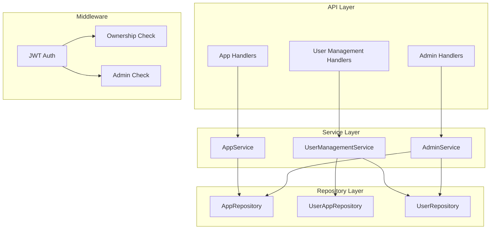

# Design Document: App User Management

## Overview

Tính năng App User Management mở rộng Auth Server để cho phép App Owner quản lý user trong phạm vi app của mình. Thiết kế này bổ sung các thành phần mới vào kiến trúc hiện có mà không thay đổi core authentication flow.

## Architecture



## Components and Interfaces

### 1. UserAppRepository

Quản lý quan hệ user-app và trạng thái.

```rust
pub struct UserApp {
    pub user_id: Uuid,
    pub app_id: Uuid,
    pub status: UserAppStatus,
    pub banned_at: Option<DateTime<Utc>>,
    pub banned_reason: Option<String>,
    pub created_at: DateTime<Utc>,
}

pub enum UserAppStatus {
    Active,
    Banned,
}

impl UserAppRepository {
    // Tạo user-app association
    async fn create(&self, user_id: Uuid, app_id: Uuid) -> Result<UserApp>;
    
    // Tìm user-app association
    async fn find(&self, user_id: Uuid, app_id: Uuid) -> Result<Option<UserApp>>;
    
    // Cập nhật status
    async fn update_status(&self, user_id: Uuid, app_id: Uuid, status: UserAppStatus, 
                           banned_reason: Option<String>) -> Result<UserApp>;
    
    // Xóa user-app association
    async fn delete(&self, user_id: Uuid, app_id: Uuid) -> Result<()>;
    
    // Liệt kê users trong app
    async fn list_by_app(&self, app_id: Uuid, page: u32, limit: u32) -> Result<Vec<UserApp>>;
    
    // Kiểm tra user có bị ban không
    async fn is_banned(&self, user_id: Uuid, app_id: Uuid) -> Result<bool>;
}
```

### 2. AppRepository Updates

Bổ sung owner_id vào App model.

```rust
pub struct App {
    pub id: Uuid,
    pub code: String,
    pub name: String,
    pub owner_id: Option<Uuid>,  // New field
    pub created_at: DateTime<Utc>,
}

impl AppRepository {
    // Existing methods...
    
    // Tạo app với owner
    async fn create_with_owner(&self, code: String, name: String, owner_id: Uuid) -> Result<App>;
    
    // Kiểm tra ownership
    async fn is_owner(&self, app_id: Uuid, user_id: Uuid) -> Result<bool>;
    
    // Lấy owner của app
    async fn get_owner(&self, app_id: Uuid) -> Result<Option<User>>;
}
```

### 3. UserRepository Updates

Bổ sung is_system_admin flag.

```rust
pub struct User {
    pub id: Uuid,
    pub email: String,
    pub password_hash: String,
    pub is_active: bool,
    pub email_verified: bool,
    pub is_system_admin: bool,  // New field
    pub created_at: DateTime<Utc>,
}

impl UserRepository {
    // Existing methods...
    
    // Kiểm tra system admin
    async fn is_system_admin(&self, user_id: Uuid) -> Result<bool>;
    
    // Set system admin status
    async fn set_system_admin(&self, user_id: Uuid, is_admin: bool) -> Result<()>;
    
    // Deactivate user globally
    async fn deactivate(&self, user_id: Uuid) -> Result<()>;
    
    // List all users (for admin)
    async fn list_all(&self, page: u32, limit: u32) -> Result<Vec<User>>;
}
```

### 4. UserManagementService

Service xử lý logic quản lý user trong app.

```rust
impl UserManagementService {
    // Đăng ký user vào app
    async fn register_to_app(&self, user_id: Uuid, app_id: Uuid) -> Result<UserApp>;
    
    // Ban user khỏi app
    async fn ban_user(&self, actor_id: Uuid, user_id: Uuid, app_id: Uuid, 
                      reason: Option<String>) -> Result<UserApp>;
    
    // Unban user
    async fn unban_user(&self, actor_id: Uuid, user_id: Uuid, app_id: Uuid) -> Result<UserApp>;
    
    // Remove user khỏi app
    async fn remove_user(&self, actor_id: Uuid, user_id: Uuid, app_id: Uuid) -> Result<()>;
    
    // List users trong app
    async fn list_app_users(&self, actor_id: Uuid, app_id: Uuid, 
                            page: u32, limit: u32) -> Result<Vec<AppUserInfo>>;
    
    // Helper: kiểm tra quyền (owner hoặc admin)
    async fn check_permission(&self, actor_id: Uuid, app_id: Uuid) -> Result<bool>;
}
```

### 5. AdminService

Service cho System Admin operations.

```rust
impl AdminService {
    // List all users
    async fn list_all_users(&self, actor_id: Uuid, page: u32, limit: u32) -> Result<Vec<User>>;
    
    // List all apps
    async fn list_all_apps(&self, actor_id: Uuid, page: u32, limit: u32) -> Result<Vec<App>>;
    
    // Deactivate user globally
    async fn deactivate_user(&self, actor_id: Uuid, user_id: Uuid) -> Result<()>;
    
    // Helper: verify system admin
    async fn verify_admin(&self, actor_id: Uuid) -> Result<()>;
}
```

## Data Models

### Database Schema Updates

```sql
-- Add owner_id to apps table
ALTER TABLE apps ADD COLUMN owner_id UUID REFERENCES users(id);

-- Add is_system_admin to users table
ALTER TABLE users ADD COLUMN is_system_admin BOOLEAN NOT NULL DEFAULT FALSE;

-- Create user_apps table
CREATE TABLE user_apps (
    user_id UUID NOT NULL REFERENCES users(id) ON DELETE CASCADE,
    app_id UUID NOT NULL REFERENCES apps(id) ON DELETE CASCADE,
    status VARCHAR(20) NOT NULL DEFAULT 'active',
    banned_at TIMESTAMP WITH TIME ZONE,
    banned_reason TEXT,
    created_at TIMESTAMP WITH TIME ZONE NOT NULL DEFAULT NOW(),
    PRIMARY KEY (user_id, app_id)
);

CREATE INDEX idx_user_apps_app_id ON user_apps(app_id);
CREATE INDEX idx_user_apps_status ON user_apps(status);
```

### DTOs

```rust
// Request DTOs
pub struct RegisterToAppRequest {
    pub app_id: Uuid,
}

pub struct BanUserRequest {
    pub reason: Option<String>,
}

// Response DTOs
pub struct AppUserInfo {
    pub user_id: Uuid,
    pub email: String,
    pub status: UserAppStatus,
    pub roles: Vec<String>,
    pub banned_at: Option<DateTime<Utc>>,
    pub banned_reason: Option<String>,
    pub created_at: DateTime<Utc>,
}

pub struct PaginatedResponse<T> {
    pub data: Vec<T>,
    pub page: u32,
    pub limit: u32,
    pub total: u64,
}
```

## Correctness Properties

*A property is a characteristic or behavior that should hold true across all valid executions of a system—essentially, a formal statement about what the system should do. Properties serve as the bridge between human-readable specifications and machine-verifiable correctness guarantees.*

### Property 1: App Creation Assigns Owner

*For any* user creating an app, the created app SHALL have that user as owner, and querying the app's owner SHALL return the creating user.

**Validates: Requirements 1.1, 1.3, 1.4**

### Property 2: User App Registration Creates Active Association

*For any* non-banned user registering to an app, the system SHALL create a user_app association with status "active".

**Validates: Requirements 2.1**

### Property 3: Banned User Registration Rejection

*For any* banned user attempting to register to an app, the system SHALL reject the registration with an appropriate error.

**Validates: Requirements 2.2**

### Property 4: Duplicate Registration Rejection

*For any* user already registered to an app, attempting to register again SHALL be rejected.

**Validates: Requirements 2.3**

### Property 5: Ban Operation Updates Status

*For any* App_Owner banning a user, the user_app status SHALL be updated to "banned" with a recorded timestamp.

**Validates: Requirements 3.1, 3.2**

### Property 6: Non-Owner Authorization Rejection

*For any* non-owner, non-admin user attempting to ban, unban, remove, or list users in an app, the system SHALL reject the request with authorization error.

**Validates: Requirements 3.3, 4.2, 5.2, 6.3**

### Property 7: Banned User Login Rejection

*For any* banned user attempting to login to an app, the system SHALL reject the login and indicate the user is banned.

**Validates: Requirements 3.4**

### Property 8: Ban/Unban Round Trip

*For any* user, banning then unbanning SHALL restore the user_app status to "active" and clear banned_at.

**Validates: Requirements 4.1**

### Property 9: Unban Idempotence

*For any* non-banned user, unbanning SHALL succeed without changes (idempotent operation).

**Validates: Requirements 4.3**

### Property 10: Remove User Deletes Associations

*For any* App_Owner removing a user, the user_app association and all user_app_roles for that user in that app SHALL be deleted.

**Validates: Requirements 5.1**

### Property 11: Remove Idempotence

*For any* unregistered user, removing SHALL succeed without changes (idempotent operation).

**Validates: Requirements 5.3**

### Property 12: List App Users Returns All Registered Users

*For any* App_Owner listing users, the response SHALL include all users registered to the app with their status, email, roles, banned_at, and banned_reason.

**Validates: Requirements 6.1, 6.2**

### Property 13: System Admin Override

*For any* System_Admin performing app management actions (ban, unban, remove, list), the system SHALL allow the action regardless of app ownership.

**Validates: Requirements 7.2, 7.3, 7.4**

### Property 14: System Admin Global Deactivation

*For any* System_Admin deactivating a user, the user's is_active flag SHALL be set to false globally.

**Validates: Requirements 7.5**

## Error Handling

### Error Types

```rust
pub enum UserManagementError {
    // Authorization errors
    NotAppOwner,
    NotSystemAdmin,
    
    // User state errors
    UserBanned { reason: Option<String> },
    UserAlreadyRegistered,
    UserNotRegistered,
    UserNotFound,
    
    // App errors
    AppNotFound,
    
    // Database errors
    DatabaseError(String),
}

impl IntoResponse for UserManagementError {
    fn into_response(self) -> Response {
        let (status, message) = match self {
            Self::NotAppOwner => (StatusCode::FORBIDDEN, "Not app owner"),
            Self::NotSystemAdmin => (StatusCode::FORBIDDEN, "Not system admin"),
            Self::UserBanned { reason } => (StatusCode::FORBIDDEN, "User is banned"),
            Self::UserAlreadyRegistered => (StatusCode::CONFLICT, "User already registered"),
            Self::UserNotRegistered => (StatusCode::NOT_FOUND, "User not registered"),
            Self::UserNotFound => (StatusCode::NOT_FOUND, "User not found"),
            Self::AppNotFound => (StatusCode::NOT_FOUND, "App not found"),
            Self::DatabaseError(_) => (StatusCode::INTERNAL_SERVER_ERROR, "Database error"),
        };
        // Return JSON error response
    }
}
```

## Testing Strategy

### Unit Tests

- Test individual repository methods với mock database
- Test service logic với mock repositories
- Test authorization checks

### Property-Based Tests

Sử dụng `proptest` crate để test các correctness properties:

- Mỗi property test chạy tối thiểu 100 iterations
- Generate random users, apps, và actions
- Verify invariants hold across all generated inputs

**Test Configuration:**
```rust
proptest! {
    #![proptest_config(ProptestConfig::with_cases(100))]
    
    // Property tests here
}
```

### Integration Tests

- Test full API request/response cycle
- Test authorization middleware
- Test database constraints

### Test Coverage Matrix

| Property | Unit Test | Property Test | Integration Test |
|----------|-----------|---------------|------------------|
| 1. App Creation Assigns Owner | ✓ | ✓ | ✓ |
| 2. User Registration Active | ✓ | ✓ | ✓ |
| 3. Banned User Rejection | ✓ | ✓ | ✓ |
| 4. Duplicate Registration | ✓ | ✓ | ✓ |
| 5. Ban Updates Status | ✓ | ✓ | ✓ |
| 6. Non-Owner Rejection | ✓ | ✓ | ✓ |
| 7. Banned Login Rejection | ✓ | ✓ | ✓ |
| 8. Ban/Unban Round Trip | ✓ | ✓ | ✓ |
| 9. Unban Idempotence | ✓ | ✓ | - |
| 10. Remove Deletes | ✓ | ✓ | ✓ |
| 11. Remove Idempotence | ✓ | ✓ | - |
| 12. List Returns All | ✓ | ✓ | ✓ |
| 13. Admin Override | ✓ | ✓ | ✓ |
| 14. Admin Deactivation | ✓ | ✓ | ✓ |
