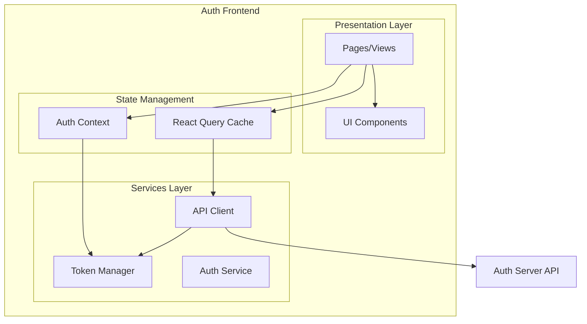

# Design Document: Auth Frontend

## Overview

Auth Frontend là một Single Page Application (SPA) được xây dựng với Vite + React + TypeScript. Ứng dụng sử dụng React Router cho navigation, React Query cho state management và API calls, và Tailwind CSS + shadcn/ui cho UI components.

## Architecture



## Components and Interfaces

### Project Structure

```
frontend/
├── src/
│   ├── components/
│   │   ├── ui/              # shadcn/ui components
│   │   ├── layout/          # Layout components
│   │   │   ├── Header.tsx
│   │   │   ├── Sidebar.tsx
│   │   │   └── MainLayout.tsx
│   │   └── forms/           # Form components
│   │       ├── LoginForm.tsx
│   │       ├── RegisterForm.tsx
│   │       └── AppForm.tsx
│   ├── pages/
│   │   ├── auth/
│   │   │   ├── LoginPage.tsx
│   │   │   ├── RegisterPage.tsx
│   │   │   ├── ForgotPasswordPage.tsx
│   │   │   └── ResetPasswordPage.tsx
│   │   ├── dashboard/
│   │   │   └── DashboardPage.tsx
│   │   ├── apps/
│   │   │   ├── AppsPage.tsx
│   │   │   └── AppDetailPage.tsx
│   │   └── NotFoundPage.tsx
│   ├── services/
│   │   ├── api.ts           # Axios instance with interceptors
│   │   ├── auth.ts          # Auth API calls
│   │   ├── apps.ts          # Apps API calls
│   │   ├── roles.ts         # Roles API calls
│   │   └── permissions.ts   # Permissions API calls
│   ├── hooks/
│   │   ├── useAuth.ts       # Auth context hook
│   │   └── useApi.ts        # React Query hooks
│   ├── contexts/
│   │   └── AuthContext.tsx  # Auth state management
│   ├── types/
│   │   └── index.ts         # TypeScript interfaces
│   ├── lib/
│   │   └── utils.ts         # Utility functions
│   ├── App.tsx
│   └── main.tsx
├── index.html
├── tailwind.config.js
├── vite.config.ts
└── package.json
```

### Core Interfaces

```typescript
// types/index.ts

// Auth Types
interface User {
  id: string;
  email: string;
}

interface TokenResponse {
  access_token: string;
  refresh_token: string;
  token_type: string;
  expires_in: number;
}

interface LoginRequest {
  email: string;
  password: string;
}

interface RegisterRequest {
  email: string;
  password: string;
}

interface ForgotPasswordRequest {
  email: string;
}

interface ResetPasswordRequest {
  token: string;
  new_password: string;
}

// App Types
interface App {
  id: string;
  code: string;
  name: string;
}

interface CreateAppRequest {
  code: string;
  name: string;
}

// Role Types
interface Role {
  id: string;
  app_id: string;
  name: string;
}

interface CreateRoleRequest {
  name: string;
}

// Permission Types
interface Permission {
  id: string;
  app_id: string;
  code: string;
}

interface CreatePermissionRequest {
  code: string;
}

// Error Types
interface ApiError {
  error: string;
  message: string;
  status_code: number;
}

// Auth Context Types
interface AuthState {
  user: User | null;
  isAuthenticated: boolean;
  isLoading: boolean;
}

interface AuthContextType extends AuthState {
  login: (credentials: LoginRequest) => Promise<void>;
  register: (data: RegisterRequest) => Promise<void>;
  logout: () => void;
  refreshToken: () => Promise<void>;
}
```

### API Client

```typescript
// services/api.ts
import axios from 'axios';

const API_BASE_URL = import.meta.env.VITE_API_URL || 'http://localhost:3000';

const api = axios.create({
  baseURL: API_BASE_URL,
  headers: {
    'Content-Type': 'application/json',
  },
});

// Request interceptor - attach token
api.interceptors.request.use((config) => {
  const token = localStorage.getItem('access_token');
  if (token) {
    config.headers.Authorization = `Bearer ${token}`;
  }
  return config;
});

// Response interceptor - handle token refresh
api.interceptors.response.use(
  (response) => response,
  async (error) => {
    const originalRequest = error.config;
    
    if (error.response?.status === 401 && !originalRequest._retry) {
      originalRequest._retry = true;
      
      try {
        const refreshToken = localStorage.getItem('refresh_token');
        const response = await axios.post(`${API_BASE_URL}/auth/refresh`, {
          refresh_token: refreshToken,
        });
        
        const { access_token, refresh_token } = response.data;
        localStorage.setItem('access_token', access_token);
        localStorage.setItem('refresh_token', refresh_token);
        
        originalRequest.headers.Authorization = `Bearer ${access_token}`;
        return api(originalRequest);
      } catch (refreshError) {
        localStorage.removeItem('access_token');
        localStorage.removeItem('refresh_token');
        window.location.href = '/login';
        return Promise.reject(refreshError);
      }
    }
    
    return Promise.reject(error);
  }
);

export default api;
```

### Auth Context

```typescript
// contexts/AuthContext.tsx
import { createContext, useContext, useState, useEffect, ReactNode } from 'react';
import { jwtDecode } from 'jwt-decode';
import * as authService from '../services/auth';

const AuthContext = createContext<AuthContextType | undefined>(undefined);

export function AuthProvider({ children }: { children: ReactNode }) {
  const [state, setState] = useState<AuthState>({
    user: null,
    isAuthenticated: false,
    isLoading: true,
  });

  useEffect(() => {
    // Check for existing token on mount
    const token = localStorage.getItem('access_token');
    if (token) {
      try {
        const decoded = jwtDecode<{ sub: string; exp: number }>(token);
        if (decoded.exp * 1000 > Date.now()) {
          setState({
            user: { id: decoded.sub, email: '' },
            isAuthenticated: true,
            isLoading: false,
          });
        } else {
          // Token expired, try refresh
          refreshToken();
        }
      } catch {
        localStorage.removeItem('access_token');
        localStorage.removeItem('refresh_token');
        setState({ user: null, isAuthenticated: false, isLoading: false });
      }
    } else {
      setState({ user: null, isAuthenticated: false, isLoading: false });
    }
  }, []);

  const login = async (credentials: LoginRequest) => {
    const response = await authService.login(credentials);
    localStorage.setItem('access_token', response.access_token);
    localStorage.setItem('refresh_token', response.refresh_token);
    
    const decoded = jwtDecode<{ sub: string }>(response.access_token);
    setState({
      user: { id: decoded.sub, email: credentials.email },
      isAuthenticated: true,
      isLoading: false,
    });
  };

  const register = async (data: RegisterRequest) => {
    await authService.register(data);
  };

  const logout = () => {
    localStorage.removeItem('access_token');
    localStorage.removeItem('refresh_token');
    setState({ user: null, isAuthenticated: false, isLoading: false });
  };

  const refreshToken = async () => {
    try {
      const token = localStorage.getItem('refresh_token');
      if (!token) throw new Error('No refresh token');
      
      const response = await authService.refresh(token);
      localStorage.setItem('access_token', response.access_token);
      localStorage.setItem('refresh_token', response.refresh_token);
      
      const decoded = jwtDecode<{ sub: string }>(response.access_token);
      setState({
        user: { id: decoded.sub, email: '' },
        isAuthenticated: true,
        isLoading: false,
      });
    } catch {
      logout();
    }
  };

  return (
    <AuthContext.Provider value={{ ...state, login, register, logout, refreshToken }}>
      {children}
    </AuthContext.Provider>
  );
}

export const useAuth = () => {
  const context = useContext(AuthContext);
  if (!context) {
    throw new Error('useAuth must be used within AuthProvider');
  }
  return context;
};
```

### Protected Route Component

```typescript
// components/ProtectedRoute.tsx
import { Navigate, useLocation } from 'react-router-dom';
import { useAuth } from '../hooks/useAuth';

interface ProtectedRouteProps {
  children: React.ReactNode;
}

export function ProtectedRoute({ children }: ProtectedRouteProps) {
  const { isAuthenticated, isLoading } = useAuth();
  const location = useLocation();

  if (isLoading) {
    return <div>Loading...</div>;
  }

  if (!isAuthenticated) {
    return <Navigate to="/login" state={{ from: location }} replace />;
  }

  return <>{children}</>;
}
```

## Data Models

### Token Storage

Tokens được lưu trong localStorage với keys:
- `access_token`: JWT access token
- `refresh_token`: JWT refresh token

### React Query Cache Keys

```typescript
const queryKeys = {
  apps: ['apps'] as const,
  app: (id: string) => ['apps', id] as const,
  roles: (appId: string) => ['apps', appId, 'roles'] as const,
  permissions: (appId: string) => ['apps', appId, 'permissions'] as const,
};
```

## Correctness Properties

*A property is a characteristic or behavior that should hold true across all valid executions of a system-essentially, a formal statement about what the system should do. Properties serve as the bridge between human-readable specifications and machine-verifiable correctness guarantees.*


### Property 1: API Error to UI Message Mapping

*For any* API error response with a known error code (invalid_email, weak_password, email_exists, invalid_credentials, user_inactive, app_code_exists, role_name_exists, permission_code_exists), the UI SHALL display the corresponding user-friendly error message.

**Validates: Requirements 1.3, 1.4, 1.5, 2.5, 2.6, 5.5, 6.5, 7.5**

### Property 2: Token Storage Round-Trip

*For any* successful login response containing access_token and refresh_token, storing them via Token_Manager and then retrieving them SHALL return the same token values.

**Validates: Requirements 2.3, 3.4**

### Property 3: Logout Clears All Tokens

*For any* authenticated state with stored tokens, calling logout SHALL result in both access_token and refresh_token being removed from storage.

**Validates: Requirements 3.4**

### Property 4: Protected Route Access Control

*For any* protected route, if the user is not authenticated, the route SHALL redirect to login page. If the user is authenticated, the route SHALL render the protected content.

**Validates: Requirements 9.1, 9.2**

### Property 5: API Request Token Attachment

*For any* API request to a protected endpoint, the API_Client SHALL attach the access_token in the Authorization header with "Bearer" prefix.

**Validates: Requirements 3.5**

### Property 6: Successful Creation Updates List

*For any* successful creation operation (app, role, or permission), the corresponding list in the UI SHALL be updated to include the newly created item.

**Validates: Requirements 5.4, 6.4, 7.4**

### Property 7: Form Submission Triggers Correct API Call

*For any* form submission (register, login, forgot-password, reset-password, create-app, create-role, create-permission, assign-role), the frontend SHALL send a request to the correct API endpoint with the form data.

**Validates: Requirements 1.2, 2.2, 4.2, 4.5, 5.3, 6.3, 7.3, 8.3**

### Property 8: Token Auto-Refresh Before Expiry

*For any* access_token that is within 1 minute of expiration, the Token_Manager SHALL automatically trigger a refresh request before the token expires.

**Validates: Requirements 3.2**

## Error Handling

### API Error Handling Strategy

```typescript
// Error mapping for user-friendly messages
const errorMessages: Record<string, string> = {
  invalid_email: 'Invalid email format',
  weak_password: 'Password does not meet requirements',
  email_exists: 'Email already exists',
  invalid_credentials: 'Invalid email or password',
  user_inactive: 'Account is inactive',
  app_code_exists: 'App code already exists',
  role_name_exists: 'Role name already exists in this app',
  permission_code_exists: 'Permission code already exists in this app',
  app_not_found: 'App not found',
  user_not_found: 'User not found',
  role_not_found: 'Role not found',
  invalid_token: 'Invalid or expired token',
  token_expired: 'Session expired, please login again',
};

function getErrorMessage(error: ApiError): string {
  return errorMessages[error.error] || error.message || 'An unexpected error occurred';
}
```

### Network Error Handling

- Display "Network error. Please check your connection." for network failures
- Implement retry logic with exponential backoff for transient failures
- Show loading states during API calls

### Token Refresh Error Handling

- If refresh fails with 401, clear tokens and redirect to login
- If refresh fails with network error, retry up to 3 times
- Show session expired notification before redirect

## Testing Strategy

### Testing Framework

- **Unit Testing**: Vitest
- **Component Testing**: React Testing Library
- **Property-Based Testing**: fast-check
- **E2E Testing**: Playwright (optional)

### Unit Tests

Unit tests sẽ cover:
- Individual component rendering
- Form validation logic
- Error message mapping
- Token storage utilities
- API service functions

### Property-Based Tests

Property tests sẽ verify các correctness properties đã định nghĩa:

1. **Error Message Mapping Property Test**
   - Generate random error codes from known set
   - Verify correct message is returned

2. **Token Storage Round-Trip Property Test**
   - Generate random valid JWT-like strings
   - Store and retrieve, verify equality

3. **Protected Route Property Test**
   - Generate random auth states (authenticated/unauthenticated)
   - Verify correct behavior for each state

4. **API Request Token Attachment Property Test**
   - Generate random tokens
   - Verify all requests include correct Authorization header

### Test Configuration

```typescript
// vitest.config.ts
import { defineConfig } from 'vitest/config';
import react from '@vitejs/plugin-react';

export default defineConfig({
  plugins: [react()],
  test: {
    environment: 'jsdom',
    globals: true,
    setupFiles: ['./src/test/setup.ts'],
  },
});
```

### Property Test Example

```typescript
// Feature: auth-frontend, Property 1: API Error to UI Message Mapping
import { fc } from 'fast-check';
import { getErrorMessage } from '../lib/errors';

const knownErrorCodes = [
  'invalid_email',
  'weak_password', 
  'email_exists',
  'invalid_credentials',
  'user_inactive',
  'app_code_exists',
  'role_name_exists',
  'permission_code_exists',
];

describe('Error Message Mapping', () => {
  it('should return user-friendly message for all known error codes', () => {
    fc.assert(
      fc.property(
        fc.constantFrom(...knownErrorCodes),
        (errorCode) => {
          const error = { error: errorCode, message: '', status_code: 400 };
          const message = getErrorMessage(error);
          return message !== '' && message !== errorCode;
        }
      ),
      { numRuns: 100 }
    );
  });
});
```
