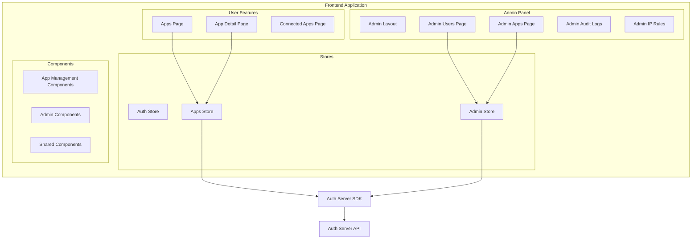

# Design Document: Frontend Admin & Apps Management

## Overview

Mở rộng Auth Frontend với các tính năng quản lý App cho user thường và Admin Panel hoàn chỉnh. Design này tận dụng SDK TypeScript có sẵn và tuân theo patterns đã thiết lập trong codebase hiện tại (React + Vite + shadcn/ui + Zustand).

## Architecture



## Components and Interfaces

### Route Structure

```typescript
// User Routes
/apps                    // List user's apps
/apps/:appId             // App detail with tabs
/connected-apps          // OAuth connected apps

// Admin Routes (requires is_system_admin)
/admin                   // Admin dashboard
/admin/users             // User management
/admin/users/:userId     // User detail
/admin/apps              // App management
/admin/apps/:appId       // App detail
/admin/audit-logs        // System audit logs
/admin/ip-rules          // Global IP rules
```

### Store Interfaces

```typescript
// src/stores/appsStore.ts
interface AppsState {
  apps: AppResponse[];
  currentApp: AppDetailState | null;
  isLoading: boolean;
  error: string | null;
}

interface AppDetailState {
  app: AppResponse;
  roles: RoleResponse[];
  permissions: PermissionResponse[];
  users: AppUsersResponse;
  webhooks: WebhookResponse[];
  apiKeys: ApiKeyResponse[];
  ipRules: IpRuleResponse[];
}

interface AppsActions {
  fetchApps: () => Promise<void>;
  createApp: (data: CreateAppRequest) => Promise<AppResponse>;
  regenerateSecret: (appId: string) => Promise<string>;
  fetchAppDetail: (appId: string) => Promise<void>;
  // Role actions
  createRole: (appId: string, name: string) => Promise<void>;
  assignRole: (appId: string, userId: string, roleId: string) => Promise<void>;
  removeRole: (appId: string, userId: string, roleId: string) => Promise<void>;
  // Permission actions
  createPermission: (appId: string, code: string) => Promise<void>;
  // User actions
  banUser: (appId: string, userId: string) => Promise<void>;
  unbanUser: (appId: string, userId: string) => Promise<void>;
  removeUser: (appId: string, userId: string) => Promise<void>;
  // Webhook actions
  createWebhook: (appId: string, data: CreateWebhookRequest) => Promise<WebhookWithSecretResponse>;
  updateWebhook: (appId: string, webhookId: string, data: UpdateWebhookRequest) => Promise<void>;
  deleteWebhook: (appId: string, webhookId: string) => Promise<void>;
  // API Key actions
  createApiKey: (appId: string, data: CreateApiKeyRequest) => Promise<ApiKeyWithSecretResponse>;
  updateApiKey: (appId: string, keyId: string, data: UpdateApiKeyRequest) => Promise<void>;
  revokeApiKey: (appId: string, keyId: string) => Promise<void>;
  deleteApiKey: (appId: string, keyId: string) => Promise<void>;
  // IP Rule actions
  createIpRule: (appId: string, data: CreateIpRuleRequest) => Promise<void>;
  deleteIpRule: (appId: string, ruleId: string) => Promise<void>;
}

// src/stores/adminStore.ts
interface AdminState {
  users: PaginatedResponse<AdminUserDetail> | null;
  apps: PaginatedResponse<AdminAppDetail> | null;
  auditLogs: AuditLogsResponse | null;
  ipRules: IpRuleResponse[];
  currentUser: AdminUserDetail | null;
  currentApp: AdminAppDetail | null;
  isLoading: boolean;
  error: string | null;
}

interface AdminActions {
  // User management
  fetchUsers: (params?: PaginationParams) => Promise<void>;
  searchUsers: (params: SearchUsersParams) => Promise<void>;
  fetchUser: (userId: string) => Promise<void>;
  updateUser: (userId: string, data: AdminUpdateUserRequest) => Promise<void>;
  deleteUser: (userId: string) => Promise<void>;
  deactivateUser: (userId: string) => Promise<void>;
  activateUser: (userId: string) => Promise<void>;
  unlockUser: (userId: string) => Promise<void>;
  getUserRoles: (userId: string) => Promise<UserRolesInfo>;
  // App management
  fetchApps: (params?: PaginationParams) => Promise<void>;
  fetchApp: (appId: string) => Promise<void>;
  updateApp: (appId: string, data: AdminUpdateAppRequest) => Promise<void>;
  deleteApp: (appId: string) => Promise<void>;
  // Audit logs
  fetchAuditLogs: (params?: PaginationParams) => Promise<void>;
  // IP Rules
  fetchIpRules: () => Promise<void>;
  createIpRule: (data: CreateIpRuleRequest) => Promise<void>;
  checkIp: (ip: string, appId?: string) => Promise<IpCheckResponse>;
  deleteIpRule: (ruleId: string) => Promise<void>;
  // Bulk operations
  exportUsers: () => Promise<AdminUserDetail[]>;
  importUsers: (users: Partial<AdminUserDetail>[]) => Promise<number>;
  bulkAssignRole: (userIds: string[], roleId: string) => Promise<number>;
}

// src/stores/connectedAppsStore.ts
interface ConnectedAppsState {
  apps: ConnectedApp[];
  isLoading: boolean;
}

interface ConnectedAppsActions {
  fetchConnectedApps: () => Promise<void>;
  revokeConsent: (clientId: string) => Promise<void>;
}
```

### Component Structure

```
src/
├── components/
│   ├── apps/
│   │   ├── AppList.tsx
│   │   ├── AppCard.tsx
│   │   ├── CreateAppDialog.tsx
│   │   ├── AppSecretDialog.tsx
│   │   ├── RoleList.tsx
│   │   ├── CreateRoleDialog.tsx
│   │   ├── PermissionList.tsx
│   │   ├── CreatePermissionDialog.tsx
│   │   ├── AppUserList.tsx
│   │   ├── UserRoleDialog.tsx
│   │   ├── WebhookList.tsx
│   │   ├── WebhookDialog.tsx
│   │   ├── ApiKeyList.tsx
│   │   ├── ApiKeyDialog.tsx
│   │   ├── IpRuleList.tsx
│   │   └── IpRuleDialog.tsx
│   ├── connected-apps/
│   │   ├── ConnectedAppList.tsx
│   │   └── ConnectedAppCard.tsx
│   ├── admin/
│   │   ├── AdminLayout.tsx
│   │   ├── AdminSidebar.tsx
│   │   ├── AdminProtectedRoute.tsx
│   │   ├── users/
│   │   │   ├── UserTable.tsx
│   │   │   ├── UserSearchForm.tsx
│   │   │   ├── UserDetailCard.tsx
│   │   │   ├── EditUserDialog.tsx
│   │   │   ├── UserRolesCard.tsx
│   │   │   └── BulkActionsBar.tsx
│   │   ├── apps/
│   │   │   ├── AdminAppTable.tsx
│   │   │   ├── AdminAppDetailCard.tsx
│   │   │   └── EditAppDialog.tsx
│   │   ├── audit/
│   │   │   ├── AuditLogTable.tsx
│   │   │   └── AuditLogFilters.tsx
│   │   └── ip-rules/
│   │       ├── IpRuleTable.tsx
│   │       ├── CreateIpRuleDialog.tsx
│   │       └── IpCheckForm.tsx
│   └── shared/
│       ├── ConfirmDialog.tsx
│       ├── Pagination.tsx
│       └── SecretDisplay.tsx
├── pages/
│   ├── AppsPage.tsx
│   ├── AppDetailPage.tsx
│   ├── ConnectedAppsPage.tsx
│   └── admin/
│       ├── AdminDashboardPage.tsx
│       ├── AdminUsersPage.tsx
│       ├── AdminUserDetailPage.tsx
│       ├── AdminAppsPage.tsx
│       ├── AdminAppDetailPage.tsx
│       ├── AdminAuditLogsPage.tsx
│       └── AdminIpRulesPage.tsx
└── stores/
    ├── appsStore.ts
    ├── adminStore.ts
    └── connectedAppsStore.ts
```

## Data Models

### App Detail Tabs

```typescript
type AppDetailTab = 
  | 'overview'      // App info, regenerate secret
  | 'users'         // App users with role management
  | 'roles'         // Role list and creation
  | 'permissions'   // Permission list and creation
  | 'webhooks'      // Webhook management
  | 'api-keys'      // API key management
  | 'ip-rules';     // IP rule management
```

### Admin User Search

```typescript
interface UserSearchFilters {
  email?: string;
  is_active?: boolean;
  is_system_admin?: boolean;
}
```

### Bulk Selection State

```typescript
interface BulkSelectionState {
  selectedIds: Set<string>;
  selectAll: boolean;
}
```

## Correctness Properties

*A property is a characteristic or behavior that should hold true across all valid executions of a system-essentially, a formal statement about what the system should do. Properties serve as the bridge between human-readable specifications and machine-verifiable correctness guarantees.*

### Property 1: List Rendering Completeness

*For any* list of items (apps, roles, permissions, webhooks, API keys, IP rules, connected apps), when rendered by the corresponding list component, all items in the data array should appear in the rendered output.

**Validates: Requirements 1.1, 2.1, 3.1, 5.1, 6.1, 7.1, 8.1**

### Property 2: State Update After Mutation

*For any* successful create/delete operation on a list (roles, permissions, connected apps), the local state should immediately reflect the change without requiring a full page refresh.

**Validates: Requirements 2.3, 3.3, 8.3**

### Property 3: Admin Access Control

*For any* user with `is_system_admin = false`, attempting to access any `/admin/*` route should result in a redirect to the dashboard. Conversely, *for any* user with `is_system_admin = true`, the Admin link should be visible in navigation.

**Validates: Requirements 9.1, 9.2, 9.3, 15.2**

### Property 4: Pagination Consistency

*For any* paginated list (admin users, admin apps, audit logs, app users), the displayed items should match the current page, and pagination controls should correctly reflect total pages based on total count and page size.

**Validates: Requirements 4.1, 10.1, 11.1, 12.1**

### Property 5: Search Filter Accuracy

*For any* search query on admin users, the returned results should only include users matching the specified filter criteria (email contains search term, is_active matches, is_system_admin matches).

**Validates: Requirements 10.2**

### Property 6: Audit Log Display Completeness

*For any* audit log entry, the rendered row should display all required fields: user identifier, action type, IP address, user agent, and timestamp.

**Validates: Requirements 12.2**

### Property 7: Bulk Selection State

*For any* selection of users in the admin user list, the bulk action buttons should be enabled if and only if at least one user is selected.

**Validates: Requirements 14.1**

### Property 8: IP Check Result Display

*For any* IP address checked via the admin IP check form, the result should clearly indicate whether the IP is allowed or blocked, along with the matching rule type if applicable.

**Validates: Requirements 13.3**

## Error Handling

### API Error Handling

```typescript
// Centralized error handling in stores
const handleApiError = (error: unknown): string => {
  if (error instanceof AuthServerError) {
    return error.message;
  }
  return 'An unexpected error occurred';
};

// Usage in store actions
try {
  await authClient.adminDeleteUser(userId);
  // Update state
} catch (error) {
  set({ error: handleApiError(error) });
  throw error;
}
```

### Error States

- Loading states for all async operations
- Error messages displayed via toast notifications
- Retry options for failed requests
- Graceful degradation when API is unavailable

### Confirmation Dialogs

Destructive actions require confirmation:
- Delete user/app
- Deactivate user
- Revoke API key
- Delete webhook
- Remove user from app
- Ban user
- Revoke OAuth consent

## Testing Strategy

### Unit Tests

- Component rendering tests with mock data
- Store action tests with mocked SDK
- Form validation tests
- Route protection tests

### Property-Based Tests

Using `fast-check` library for property-based testing:

1. **List Rendering Property**: Generate random arrays of items, verify all items appear in rendered output
2. **Admin Access Control Property**: Generate users with random admin status, verify correct routing behavior
3. **Pagination Property**: Generate random page/limit/total combinations, verify correct pagination state
4. **Search Filter Property**: Generate random user data and search queries, verify filter accuracy

### Integration Tests

- Full user flows (create app → add role → assign to user)
- Admin workflows (search user → view detail → update → deactivate)
- OAuth consent management flow

### Test Configuration

```typescript
// vitest.config.ts
export default defineConfig({
  test: {
    environment: 'jsdom',
    setupFiles: ['./src/test/setup.ts'],
    coverage: {
      provider: 'v8',
      reporter: ['text', 'json', 'html'],
    },
  },
});
```

Property tests should run minimum 100 iterations to ensure adequate coverage.
